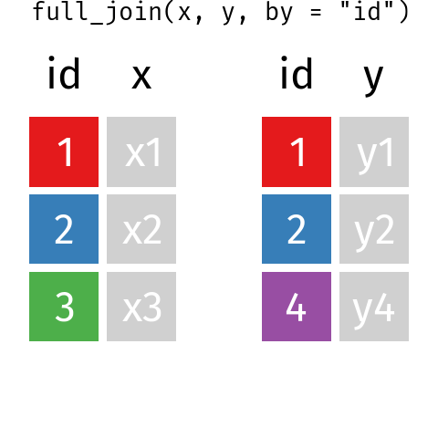
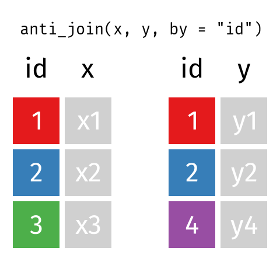

<!-- README.md is generated from README.Rmd. Please edit that file -->

```{r setup, include = FALSE}
knitr::opts_chunk$set(
  collapse = TRUE,
  comment = "#>",
  echo = FALSE,
  warning = FALSE,
  message = FALSE,
  cache = TRUE
)
```

# Tidy Animated Verbs

Garrick Aden-Buie -- [&commat;grrrck](https://twitter.com/grrrck) -- [garrickadenbuie.com](https://www.garrickadenbuie.com)


## Mutate Joins

```{r intial-dfs}
source("R/00_base.R")
df_names <- data_frame(
  .x = c(1.5, 4.5), .y = 0.25,
  value = c("x", "y"),
  size = 12,
  color = "black"
)

g <- plot_data(initial_dfs) +
  geom_text(data = df_names, family = "Fira Mono", size = 24)

ggsave(g, file = here::here("images/original-dfs.png"))
```


```{r echo=TRUE}
x
y
```

### Inner Join

```{r inner-join}
source("R/inner_join.R")
```


```{r echo=TRUE}
inner_join(x, y, by = "id")
```

### Left Join

```{r left-join}
source("R/left_join.R")
```


```{r echo=TRUE}
left_join(x, y, by = "id")
```

### Right Join

```{r right-join}
source("R/right_join.R")
```


```{r echo=TRUE}
right_join(x, y, by = "id")
```

### Full Join

```{r full-join}
source("R/full_join.R")
```



```{r echo=TRUE}
full_join(x, y, by = "id")
```

## Filtering Joins

### Semi Join

```{r semi-join}
source("R/semi_join.R")
```


```{r echo=TRUE}
semi_join(x, y, by = "id")
```

### Anti Join

```{r anti-join}
source("R/anti_join.R")
```



```{r echo=TRUE}
anti_join(x, y, by = "id")
```
