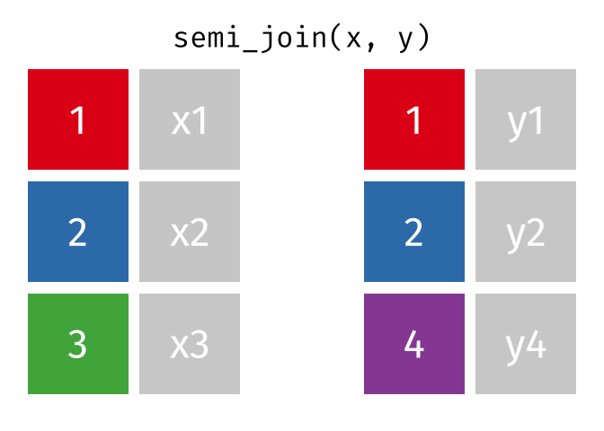

<!-- README.md is generated from README.Rmd. Please edit that file -->

```{r setup, include = FALSE}
knitr::opts_chunk$set(
  collapse = TRUE,
  comment = "#>",
  echo = FALSE,
  warning = FALSE,
  message = FALSE,
  cache = TRUE
)
```

[gganimate]: https://github.com/thomasp85/gganimate#README
[dplyr-two-table]: https://dplyr.tidyverse.org/articles/two-table.html

# Tidy Animated Verbs

Garrick Aden-Buie -- [&commat;grrrck](https://twitter.com/grrrck) -- [garrickadenbuie.com](https://www.garrickadenbuie.com)

[](https://mybinder.org/v2/gh/gadenbuie/tidy-animated-verbs/master?urlpath=rstudio)
[](https://creativecommons.org/publicdomain/zero/1.0/)

- Mutating Joins: [`inner_join()`](#inner-join), [`left_join()`](#left-join),
  [`right_join()`](#right-join), [`full_join()`](#full-join)
  
- Filtering Joins: [`semi_join()`](#semi-join), [`anti_join()`](#anti-join)

- Learn more about
    - [Relational Data](#relational-data)
    - [gganimate](#gganimate)
    

Please feel free to use these images for teaching or learning about action verbs from the [tidyverse](https://tidyverse.org).
You can directly download the [original animations](images/) or static images in [svg](images/static/svg/) or [png](images/static/png/) formats, or you can use the [scripts](R/) to recreate the images locally.

Currently, the animations cover the [dplyr two-table verbs][dplyr-two-table] and I'd like to expand the animations to include more verbs from the tidyverse.
[Suggestions are welcome!](https://github.com/gadenbuie/tidy-animated-verbs/issues)

## Mutating Joins

```{r intial-dfs}
source("R/00_base.R")
df_names <- data_frame(
  .x = c(1.5, 4.5), .y = 0.25,
  value = c("x", "y"),
  size = 12,
  color = "black"
)

g <- plot_data(initial_dfs) +
  geom_text(data = df_names, family = "Fira Mono", size = 24)

ggsave(g, file = here::here("images/original-dfs.png"))
```


```{r echo=TRUE}
x
y
```

### Inner Join

> All rows from `x` where there are matching values in `y`, and all columns from `x` and `y`.

```{r inner-join}
source("R/inner_join.R")
```


```{r echo=TRUE}
inner_join(x, y, by = "id")
```

### Left Join

> All rows from `x`, and all columns from `x` and `y`. Rows in `x` with no match in `y` will have `NA` values in the new columns.

```{r left-join}
source("R/left_join.R")
```


```{r echo=TRUE}
left_join(x, y, by = "id")
```

### Left Join (Extra Rows in y)

> ... If there are multiple matches between `x` and `y`, all combinations of the matches are returned.

```{r left-join-extra}
source("R/left_join_extra.R")
```


```{r echo=TRUE}
y_extra # has multiple rows with the key from `x`
left_join(x, y_extra, by = "id")
```

### Right Join

> All rows from y, and all columns from `x` and `y`. Rows in `y` with no match in `x` will have `NA` values in the new columns.

```{r right-join}
source("R/right_join.R")
```


```{r echo=TRUE}
right_join(x, y, by = "id")
```

### Full Join

> All rows and all columns from both `x` and `y`. Where there are not matching values, returns `NA` for the one missing.

```{r full-join}
source("R/full_join.R")
```


```{r echo=TRUE}
full_join(x, y, by = "id")
```

## Filtering Joins

### Semi Join

> All rows from `x` where there are matching values in `y`, keeping just columns from `x`.

```{r semi-join}
source("R/semi_join.R")
```



```{r echo=TRUE}
semi_join(x, y, by = "id")
```

### Anti Join

> All rows from `x` where there are not matching values in `y`, keeping just columns from `x`.

```{r anti-join}
source("R/anti_join.R")
```


```{r echo=TRUE}
anti_join(x, y, by = "id")
```

## Learn More

### Relational Data

The [Relational Data](http://r4ds.had.co.nz/relation-data.html) chapter of the
[R for Data Science](http://r4ds.had.co.nz/) book by Garrett Grolemund and Hadley Wickham
is an excellent resource for learning more about relational data.

The [dplyr two-table verbs vignette][dplyr-two-table]
and Jenny Bryan's [Cheatsheet for dplyr join functions](http://stat545.com/bit001_dplyr-cheatsheet.html)
are also great resources.

### gganimate

The animations were made possible by the newly re-written [gganimate] package by 
[Thomas Lin Pedersen](https://github.com/thomasp85)
(original by [Dave Robinson](https://github.com/dgrtwo)).
The [package readme][gganimate] provides an excellent (and quick) introduction to gganimte.
