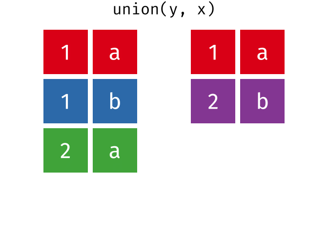
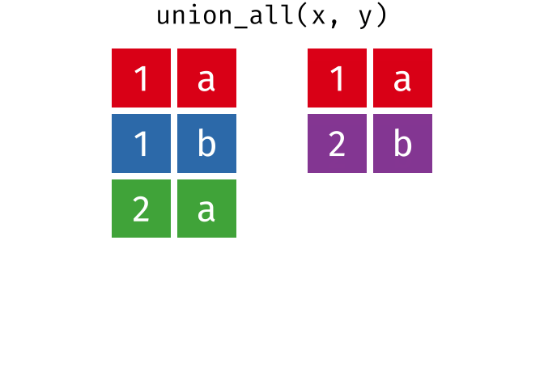
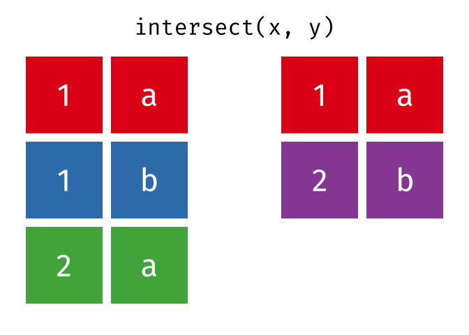
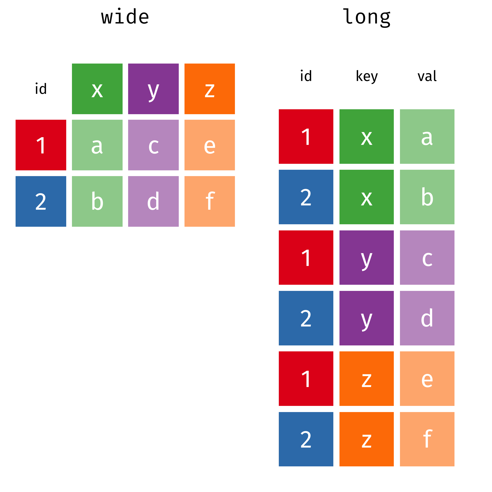

<!-- README.md is generated from README.Rmd. Please edit that file -->

```{r setup, include = FALSE}
knitr::opts_chunk$set(
  collapse = TRUE,
  comment = "#>",
  echo = FALSE,
  warning = FALSE,
  message = FALSE,
  cache = TRUE
)
```

[gganimate]: https://github.com/thomasp85/gganimate#README
[dplyr-two-table]: https://dplyr.tidyverse.org/articles/two-table.html
[r4ds]: http://r4ds.had.co.nz/
[r4ds-relational]: http://r4ds.had.co.nz/relational-data.html
[r4ds-set-ops]: http://r4ds.had.co.nz/relational-data.html#set-operations
[r4ds-tidy-data]: http://r4ds.had.co.nz/tidy-data.html#tidy-data-1
[tidyverse]: https://tidyverse.org
[tidyr]: https://tidyr.tidyverse.org

# Tidy Animated Verbs

Garrick Aden-Buie -- [&commat;grrrck](https://twitter.com/grrrck) -- [garrickadenbuie.com](https://www.garrickadenbuie.com). Set operations contributed by [Tyler Grant Smith](https://github.com/TylerGrantSmith).

[](https://mybinder.org/v2/gh/gadenbuie/tidy-animated-verbs/master?urlpath=rstudio)
[_-CC0-green.svg)](https://creativecommons.org/publicdomain/zero/1.0/)
[_-MIT-green.svg)](https://opensource.org/licenses/MIT)

- [**Mutating Joins**](#mutating-joins) — [`inner_join()`](#inner-join), [`left_join()`](#left-join),
  [`right_join()`](#right-join), [`full_join()`](#full-join)
  
- [**Filtering Joins**](#filtering-joins) — [`semi_join()`](#semi-join), [`anti_join()`](#anti-join)

- [**Set Operations**](#set-operations) — [`union()`](#union), [`union_all()`](#union-all), [`intersect()`](#intersect), [`setdiff()`](#setdiff)

- [**Tidy Data**](#tidy-data) — [`spread()` and `gather()`](#spread-and-gather)

- Learn more about
    - [Using the animations and images](#usage)
    - [Relational Data](#relational-data)
    - [gganimate](#gganimate)
    
## Background

### Usage

Please feel free to use these images for teaching or learning about action verbs from the [tidyverse](https://tidyverse.org).
You can directly download the [original animations](images/) or static images in [svg](images/static/svg/) or [png](images/static/png/) formats, or you can use the [scripts](R/) to recreate the images locally.

Currently, the animations cover the [dplyr two-table verbs][dplyr-two-table] and I'd like to expand the animations to include more verbs from the tidyverse.
[Suggestions are welcome!](https://github.com/gadenbuie/tidy-animated-verbs/issues)

### Relational Data

The [Relational Data][r4ds-relational] chapter of the
[R for Data Science][r4ds] book by Garrett Grolemund and Hadley Wickham
is an excellent resource for learning more about relational data.

The [dplyr two-table verbs vignette][dplyr-two-table]
and Jenny Bryan's [Cheatsheet for dplyr join functions](http://stat545.com/bit001_dplyr-cheatsheet.html)
are also great resources.

### gganimate

The animations were made possible by the newly re-written [gganimate] package by 
[Thomas Lin Pedersen](https://github.com/thomasp85)
(original by [Dave Robinson](https://github.com/dgrtwo)).
The [package readme][gganimate] provides an excellent (and quick) introduction to gganimte.

## Mutating Joins

> A mutating join allows you to combine variables from two tables. It first matches observations by their keys, then copies across variables from one table to the other.  
> [R for Data Science: Mutating joins](http://r4ds.had.co.nz/relational-data.html#mutating-joins)

```{r intial-dfs}
source("R/00_base_join.R")
df_names <- data_frame(
  .x = c(1.5, 4.5), .y = 0.25,
  value = c("x", "y"),
  size = 12,
  color = "black"
)

g <- plot_data(initial_join_dfs) +
  geom_text(data = df_names, family = "Fira Mono", size = 24)

save_static_plot(g, "original-dfs")
```


```{r echo=TRUE}
x
y
```

### Inner Join

> All rows from `x` where there are matching values in `y`, and all columns from `x` and `y`.

```{r inner-join}
source("R/inner_join.R")
```


```{r echo=TRUE}
inner_join(x, y, by = "id")
```

### Left Join

> All rows from `x`, and all columns from `x` and `y`. Rows in `x` with no match in `y` will have `NA` values in the new columns.

```{r left-join}
source("R/left_join.R")
```


```{r echo=TRUE}
left_join(x, y, by = "id")
```

### Left Join (Extra Rows in y)

> ... If there are multiple matches between `x` and `y`, all combinations of the matches are returned.

```{r left-join-extra}
source("R/left_join_extra.R")
```


```{r echo=TRUE}
y_extra # has multiple rows with the key from `x`
left_join(x, y_extra, by = "id")
```

### Right Join

> All rows from y, and all columns from `x` and `y`. Rows in `y` with no match in `x` will have `NA` values in the new columns.

```{r right-join}
source("R/right_join.R")
```


```{r echo=TRUE}
right_join(x, y, by = "id")
```

### Full Join

> All rows and all columns from both `x` and `y`. Where there are not matching values, returns `NA` for the one missing.

```{r full-join}
source("R/full_join.R")
```


```{r echo=TRUE}
full_join(x, y, by = "id")
```

## Filtering Joins

> Filtering joins match observations in the same way as mutating joins, but affect the observations, not the variables.
> ... Semi-joins are useful for matching filtered summary tables back to the original rows.
> ... Anti-joins are useful for diagnosing join mismatches.  
> [R for Data Science: Filtering Joins](http://r4ds.had.co.nz/relational-data.html#filtering-joins)

### Semi Join

> All rows from `x` where there are matching values in `y`, keeping just columns from `x`.

```{r semi-join}
source("R/semi_join.R")
```


```{r echo=TRUE}
semi_join(x, y, by = "id")
```

### Anti Join

> All rows from `x` where there are not matching values in `y`, keeping just columns from `x`.

```{r anti-join}
source("R/anti_join.R")
```


```{r echo=TRUE}
anti_join(x, y, by = "id")
```

## Set Operations

> Set operations are occasionally useful when you want to break a single complex filter into simpler pieces. 
> All these operations work with a complete row, comparing the values of every variable. 
> These expect the x and y inputs to have the same variables, and treat the observations like sets.  
> [R for Data Science: Set operations](http://r4ds.had.co.nz/relational-data.html#set-operations)

```{r intial-dfs-so}
source("R/00_base_set.R")
df_names <- data_frame(
  .x = c(2.5, 5.5), .y = 0.25,
  value = c("x", "y"),
  size = 12,
  color = "black"
)

g <- plot_data_set(initial_set_dfs, "", NULL, NULL) +
  geom_text(data = df_names, family = "Fira Mono", size = 24)

save_static_plot(g, "original-dfs-set-ops")
```

```{r remove-set-ops-ids}
x <- x %>% select(-id)
y <- y %>% select(-id)
```


```{r echo=TRUE}
x
y 
```

### Union

> All unique rows from `x` and `y`.

```{r union}
source("R/union.R")
<<remove-set-ops-ids>>
```


```{r echo=TRUE}
union(x, y)
```



```{r echo=TRUE}
union(y, x)
```

### Union All

> All rows from `x` and `y`, keeping duplicates.

```{r union-all}
source("R/union_all.R")
<<remove-set-ops-ids>>
```




```{r echo=TRUE}
union_all(x, y)
```


### Intersection

> Common rows in both `x` and `y`, keeping just unique rows.

```{r intersect}
source("R/intersect.R")
<<remove-set-ops-ids>>
```



```{r echo=TRUE}
intersect(x, y)
```

### Set Difference

> All rows from `x` which are not also rows in `y`, keeping just unique rows.

```{r setdiff}
source("R/setdiff.R")
<<remove-set-ops-ids>>
```


```{r echo=TRUE}
setdiff(x, y)
```


```{r echo=TRUE}
setdiff(y, x)
```

## Tidy Data

[Tidy data][r4ds-tidy-data] follows the following three rules:

1. Each variable has its own column.
1. Each observation has its own row.
1. Each value has its own cell.

Many of the tools in the [tidyverse] expect data to be formatted as a tidy dataset and the [tidyr] package provides functions to help you organize your data into tidy data.

```{r tidyr-wide-long}
source("R/tidyr_spread_gather.R")

tidy_plots <- list()
tidy_plots$wide <- bind_rows(sg_wide, sg_wide_labels)
tidy_plots$long <- bind_rows(sg_long, sg_long_labels)

tidy_plots <- map(tidy_plots, ~ mutate(., 
  .text_color = ifelse(grepl("id|key|val", value), "black", "white"),
  .text_size  = ifelse(grepl("id|key|val", value), 6, 10)
)) %>% 
  imap(~ plot_data(.x, .y))

tidy_plots$wide <- tidy_plots$wide + ylim(-6.5, 0.5)

save_static_plot(cowplot::plot_grid(plotlist = tidy_plots, axis = "t"), "original-dfs-tidy")
```



```{r echo=TRUE}
wide
long
```

### Spread and Gather

`spread(data, key, value)`

> Spread a key-value pair across multiple columns. 
> Use it when an a column contains observations from multiple variables.

`gather(data, key = "key", value = "value", ...)`

> Gather takes multiple columns and collapses into key-value pairs, duplicating all other columns as needed. 
> You use `gather()` when you notice that your column names are not names of variables, but *values* of a variable.


```{r echo=TRUE}
gather(wide, key, val, x:z)
spread(long, key, val)
```
