<!-- README.md is generated from README.Rmd. Please edit that file -->

# Tidy Animated Verbs

Garrick Aden-Buie – [@grrrck](https://twitter.com/grrrck) –
[garrickadenbuie.com](https://www.garrickadenbuie.com). Set operations
contributed by [Tyler Grant
Smith](https://github.com/TylerGrantSmith).

[](https://mybinder.org/v2/gh/gadenbuie/tidy-animated-verbs/master?urlpath=rstudio)
[_-CC0-green.svg)](https://creativecommons.org/publicdomain/zero/1.0/)
[_-MIT-green.svg)](https://opensource.org/licenses/MIT)

  - Mutating Joins: [`inner_join()`](#inner-join),
    [`left_join()`](#left-join), [`right_join()`](#right-join),
    [`full_join()`](#full-join)

  - Filtering Joins: [`semi_join()`](#semi-join),
    [`anti_join()`](#anti-join)

  - Set Operations: [`union()`](#union), [`union_all()`](#union-all),
    [`intersect()`](#intersect), [`setdiff()`](#setdiff)

  - Tidyr Operations: [`gather()`](#gather), [`spread()`](#spread)

  - Learn more about
    
      - [Relational Data](#relational-data)
      - [gganimate](#gganimate)

Please feel free to use these images for teaching or learning about
action verbs from the [tidyverse](https://tidyverse.org). You can
directly download the [original animations](images/) or static images in
[svg](images/static/svg/) or [png](images/static/png/) formats, or you
can use the [scripts](R/) to recreate the images locally.

Currently, the animations cover the [dplyr two-table
verbs](https://dplyr.tidyverse.org/articles/two-table.html) and I’d like
to expand the animations to include more verbs from the tidyverse.
[Suggestions are
welcome\!](https://github.com/gadenbuie/tidy-animated-verbs/issues)

## Installing

The in-development version of `tidyexplain` can be installed with
`devtools`:

``` r
# install.package("devtools")
devtools::install_github("gadenbuie/tidy-animated-verbs")

library(tidyexplain)
```

## Mutating Joins

``` r
x <- dplyr::data_frame(
  id = 1:3,
  x = paste0("x", 1:3)
)

y <- dplyr::data_frame(
  id = (1:4)[-3],
  y = paste0("y", (1:4)[-3])
)

animate_full_join(x, y, by = c("id"), export = "first")
```

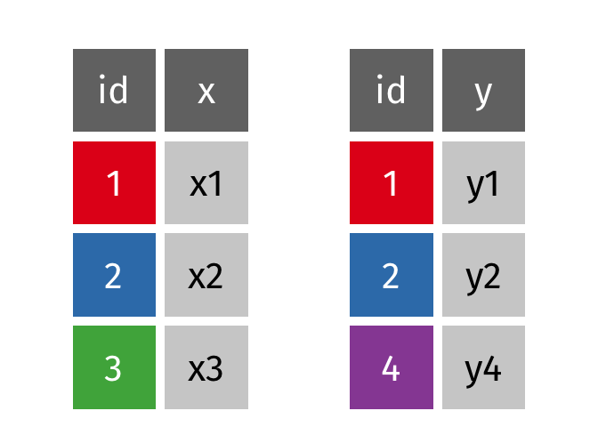<!-- -->

``` r
x
#> # A tibble: 3 x 2
#>      id x    
#>   <int> <chr>
#> 1     1 x1   
#> 2     2 x2   
#> 3     3 x3
y
#> # A tibble: 3 x 2
#>      id y    
#>   <int> <chr>
#> 1     1 y1   
#> 2     2 y2   
#> 3     4 y4
```

### Inner Join

> All rows from `x` where there are matching values in `y`, and all
> columns from `x` and `y`.

``` r
animate_inner_join(x, y, by = "id")
```

<!-- -->

``` r
dplyr::inner_join(x, y, by = "id")
#> # A tibble: 2 x 3
#>      id x     y    
#>   <int> <chr> <chr>
#> 1     1 x1    y1   
#> 2     2 x2    y2
```

### Left Join

> All rows from `x`, and all columns from `x` and `y`. Rows in `x` with
> no match in `y` will have `NA` values in the new columns.

``` r
animate_left_join(x, y, by = "id")
```

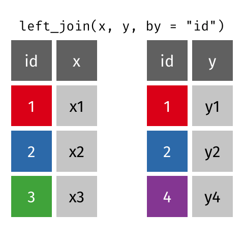<!-- -->

``` r
dplyr::left_join(x, y, by = "id")
#> # A tibble: 3 x 3
#>      id x     y    
#>   <int> <chr> <chr>
#> 1     1 x1    y1   
#> 2     2 x2    y2   
#> 3     3 x3    <NA>
```

### Left Join (Extra Rows in y)

> … If there are multiple matches between `x` and `y`, all combinations
> of the matches are returned.

``` r
y_extra <- dplyr::bind_rows(y, dplyr::data_frame(id = 2, y = "y5"))
y_extra # has multiple rows with the key from `x`
#> # A tibble: 4 x 2
#>      id y    
#>   <dbl> <chr>
#> 1     1 y1   
#> 2     2 y2   
#> 3     4 y4   
#> 4     2 y5

animate_left_join(x, y_extra, by = "id", 
  anim_opts = anim_options(title_size = 22))
```

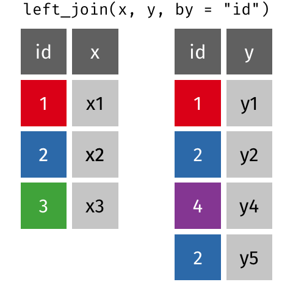<!-- -->

``` r
dplyr::left_join(x, y_extra, by = "id")
#> # A tibble: 4 x 3
#>      id x     y    
#>   <dbl> <chr> <chr>
#> 1     1 x1    y1   
#> 2     2 x2    y2   
#> 3     2 x2    y5   
#> 4     3 x3    <NA>
```

### Right Join

> All rows from y, and all columns from `x` and `y`. Rows in `y` with no
> match in `x` will have `NA` values in the new columns.

``` r
animate_right_join(x, y, by = "id")
```

<!-- -->

``` r
dplyr::right_join(x, y, by = "id")
#> # A tibble: 3 x 3
#>      id x     y    
#>   <int> <chr> <chr>
#> 1     1 x1    y1   
#> 2     2 x2    y2   
#> 3     4 <NA>  y4
```

### Full Join

> All rows and all columns from both `x` and `y`. Where there are not
> matching values, returns `NA` for the one missing.

``` r
animate_full_join(x, y, by = "id")
```

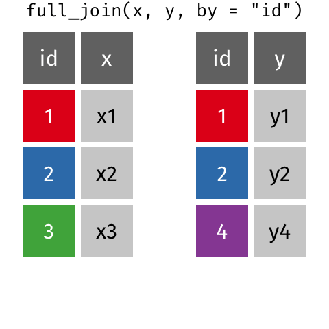<!-- -->

``` r
dplyr::full_join(x, y, by = "id")
#> # A tibble: 4 x 3
#>      id x     y    
#>   <int> <chr> <chr>
#> 1     1 x1    y1   
#> 2     2 x2    y2   
#> 3     3 x3    <NA> 
#> 4     4 <NA>  y4
```

## Filtering Joins

### Semi Join

> All rows from `x` where there are matching values in `y`, keeping just
> columns from `x`.

``` r
animate_semi_join(x, y, by = "id")
```

<!-- -->

``` r
dplyr::semi_join(x, y, by = "id")
#> # A tibble: 2 x 2
#>      id x    
#>   <int> <chr>
#> 1     1 x1   
#> 2     2 x2
```

### Anti Join

> All rows from `x` where there are not matching values in `y`, keeping
> just columns from `x`.

``` r
animate_anti_join(x, y, by = "id")
```

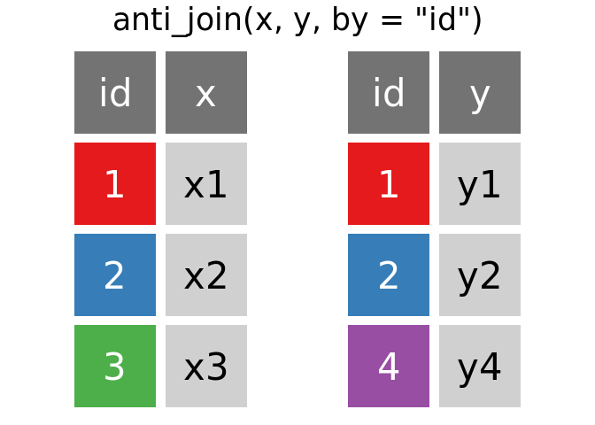<!-- -->

``` r
dplyr::anti_join(x, y, by = "id")
#> # A tibble: 1 x 2
#>      id x    
#>   <int> <chr>
#> 1     3 x3
```

## Set Operations

``` r
x <- dplyr::data_frame(
  x = c(1, 1, 2),
  y = c("a", "b", "a")
)
y <- dplyr::data_frame(
  x = c(1, 2),
  y = c("a", "b")
)

animate_union(x, y, export = "first")
```

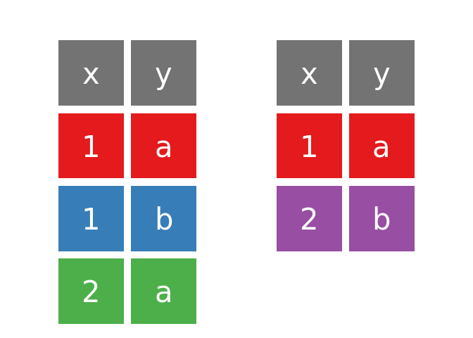<!-- -->

``` r
x
#> # A tibble: 3 x 2
#>       x y    
#>   <dbl> <chr>
#> 1     1 a    
#> 2     1 b    
#> 3     2 a
y 
#> # A tibble: 2 x 2
#>       x y    
#>   <dbl> <chr>
#> 1     1 a    
#> 2     2 b
```

### Union

> All unique rows from `x` and `y`.

``` r
animate_union(x, y)
```

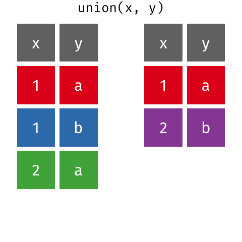<!-- -->

``` r
dplyr::union(x, y)
#> # A tibble: 4 x 2
#>       x y    
#>   <dbl> <chr>
#> 1     2 b    
#> 2     2 a    
#> 3     1 b    
#> 4     1 a
```

``` r
animate_union(y, x)
```

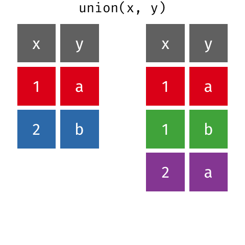<!-- -->

``` r

dplyr::union(y, x)
#> # A tibble: 4 x 2
#>       x y    
#>   <dbl> <chr>
#> 1     2 a    
#> 2     1 b    
#> 3     2 b    
#> 4     1 a
```

### Union All

> All rows from `x` and `y`, keeping duplicates.

``` r
animate_union_all(x, y)
```

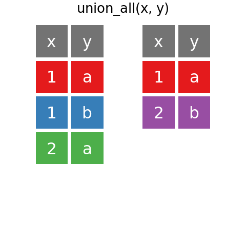<!-- -->

``` r
dplyr::union_all(x, y)
#> # A tibble: 5 x 2
#>       x y    
#>   <dbl> <chr>
#> 1     1 a    
#> 2     1 b    
#> 3     2 a    
#> 4     1 a    
#> 5     2 b
```

### Intersection

> Common rows in both `x` and `y`, keeping just unique rows.

``` r
animate_intersect(x, y)
```

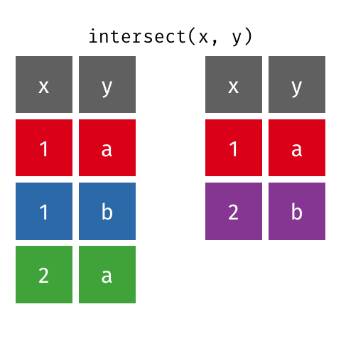<!-- -->

``` r
dplyr::intersect(x, y)
#> # A tibble: 1 x 2
#>       x y    
#>   <dbl> <chr>
#> 1     1 a
```

### Set Difference

> All rows from `x` which are not also rows in `y`, keeping just unique
> rows.

``` r
animate_setdiff(x, y)
```

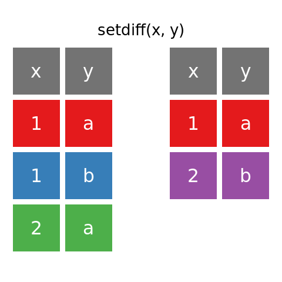<!-- -->

``` r
dplyr::setdiff(x, y)
#> # A tibble: 2 x 2
#>       x y    
#>   <dbl> <chr>
#> 1     1 b    
#> 2     2 a
```

``` r
animate_setdiff(y, x)
```

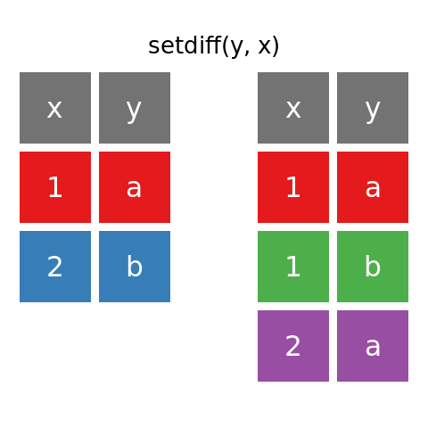<!-- -->

``` r

dplyr::setdiff(y, x)
#> # A tibble: 1 x 2
#>       x y    
#>   <dbl> <chr>
#> 1     2 b
```

## Tidy Data and `gather()`, `spread()` functionality

[Tidy data](http://r4ds.had.co.nz/tidy-data.html#tidy-data-1) follows
the following three rules:

1.  Each variable has its own column.
2.  Each observation has its own row.
3.  Each value has its own cell.

Many of the tools in the [tidyverse](https://tidyverse.org) expect data
to be formatted as a tidy dataset and the
[tidyr](https://tidyr.tidyverse.org) package provides functions to help
you organize your data into tidy data.

``` r
long <- dplyr::data_frame(
  year = c(2010, 2011, 2010, 2011, 2010, 2011),
  person = c("Alice", "Alice", "Bob", "Bob", "Charlie", "Charlie"),
  sales = c(105, 110, 100, 97, 90, 95)
)
wide <- dplyr::data_frame(
  year = 2010:2011, 
  Alice = c(105, 110), 
  Bob = c(100, 97), 
  Charlie = c(90, 95)
)
```

### Gather

> Gather takes multiple columns and collapses into key-value pairs,
> duplicating all other columns as needed. You use gather() when you
> notice that your column names are not names of variables, but values
> of a variable.

``` r
set_font_size(4.5, 15)
animate_gather(wide, key = "person", value = "sales", -year)
```

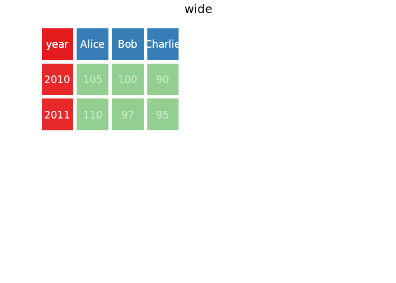<!-- -->

``` r
tidyr::gather(wide, key = "person", value = "sales", -year)
#> # A tibble: 6 x 3
#>    year person  sales
#>   <int> <chr>   <dbl>
#> 1  2010 Alice     105
#> 2  2011 Alice     110
#> 3  2010 Bob       100
#> 4  2011 Bob        97
#> 5  2010 Charlie    90
#> 6  2011 Charlie    95
```

### Spread

> Spread a key-value pair across multiple columns. Use it when an a
> column contains observations from multiple variables.

``` r
animate_spread(long, key = "person", value = "sales")
```

<!-- -->

``` r
tidyr::spread(long, key = "person", value = "sales")
#> # A tibble: 2 x 4
#>    year Alice   Bob Charlie
#>   <dbl> <dbl> <dbl>   <dbl>
#> 1  2010   105   100      90
#> 2  2011   110    97      95
```

## Learn More

### Relational Data

The [Relational Data](http://r4ds.had.co.nz/relation-data.html) chapter
of the [R for Data Science](http://r4ds.had.co.nz/) book by Garrett
Grolemund and Hadley Wickham is an excellent resource for learning more
about relational data.

The [dplyr two-table verbs
vignette](https://dplyr.tidyverse.org/articles/two-table.html) and Jenny
Bryan’s [Cheatsheet for dplyr join
functions](http://stat545.com/bit001_dplyr-cheatsheet.html) are also
great resources.

### gganimate

The animations were made possible by the newly re-written
[gganimate](https://github.com/thomasp85/gganimate#README) package by
[Thomas Lin Pedersen](https://github.com/thomasp85) (original by [Dave
Robinson](https://github.com/dgrtwo)). The [package
readme](https://github.com/thomasp85/gganimate#README) provides an
excellent (and quick) introduction to gganimte.
