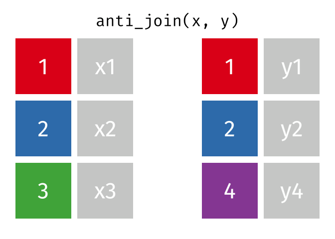

<!-- README.md is generated from README.Rmd. Please edit that file -->

# Tidy Animated Verbs

Garrick Aden-Buie – [@grrrck](https://twitter.com/grrrck) –
[garrickadenbuie.com](https://www.garrickadenbuie.com)

[](https://mybinder.org/v2/gh/gadenbuie/tidy-animated-verbs/master?urlpath=rstudio)

  - Mutate Joins: [`inner_join()`](#inner-join),
    [`left_join()`](#left-join), [`right_join()`](#right-join),
    [`full_join()`](#full-join)

  - Filtering Joins: [`semi_join()`](#semi-join),
    [`anti_join()`](#anti-join)

  - Learn more about
    
      - [Relational Data](#relational-data)
      - [gganimate](#gganimate)

## Mutate Joins


``` r
x
#> # A tibble: 3 x 2
#>      id x    
#>   <int> <chr>
#> 1     1 x1   
#> 2     2 x2   
#> 3     3 x3
y
#> # A tibble: 3 x 2
#>      id y    
#>   <int> <chr>
#> 1     1 y1   
#> 2     2 y2   
#> 3     4 y4
```

### Inner Join


``` r
inner_join(x, y, by = "id")
#> # A tibble: 2 x 3
#>      id x     y    
#>   <int> <chr> <chr>
#> 1     1 x1    y1   
#> 2     2 x2    y2
```

### Left Join


``` r
left_join(x, y, by = "id")
#> # A tibble: 3 x 3
#>      id x     y    
#>   <int> <chr> <chr>
#> 1     1 x1    y1   
#> 2     2 x2    y2   
#> 3     3 x3    <NA>
```

### Right Join


``` r
right_join(x, y, by = "id")
#> # A tibble: 3 x 3
#>      id x     y    
#>   <int> <chr> <chr>
#> 1     1 x1    y1   
#> 2     2 x2    y2   
#> 3     4 <NA>  y4
```

### Full Join


``` r
full_join(x, y, by = "id")
#> # A tibble: 4 x 3
#>      id x     y    
#>   <int> <chr> <chr>
#> 1     1 x1    y1   
#> 2     2 x2    y2   
#> 3     3 x3    <NA> 
#> 4     4 <NA>  y4
```

## Filtering Joins

### Semi Join


``` r
semi_join(x, y, by = "id")
#> # A tibble: 2 x 2
#>      id x    
#>   <int> <chr>
#> 1     1 x1   
#> 2     2 x2
```

### Anti Join



``` r
anti_join(x, y, by = "id")
#> # A tibble: 1 x 2
#>      id x    
#>   <int> <chr>
#> 1     3 x3
```

## Learn More

### Relational Data

The [Relational Data](http://r4ds.had.co.nz/relation-data.html) chapter
of the [R for Data Science](http://r4ds.had.co.nz/) book by Garrett
Grolemund and Hadley Wickham is an excellent resource for learning more
about relational data.

The [dplyr two-table verbs
vignette](https://dplyr.tidyverse.org/articles/two-table.html) and Jenny
Bryan’s [Cheatsheet for dplyr join
functions](http://stat545.com/bit001_dplyr-cheatsheet.html) are also
great resources.

### gganimate

The animations were made possible by the newly re-written
[gganimate](https://github.com/thomasp85/gganimate#README) package by
[Thomas Lin Pedersen](https://github.com/thomasp85) (original by [Dave
Robinson](https://github.com/dgrtwo)). The [package
readme](https://github.com/thomasp85/gganimate#README) provides an
excellent (and quick) introduction to gganimte.
