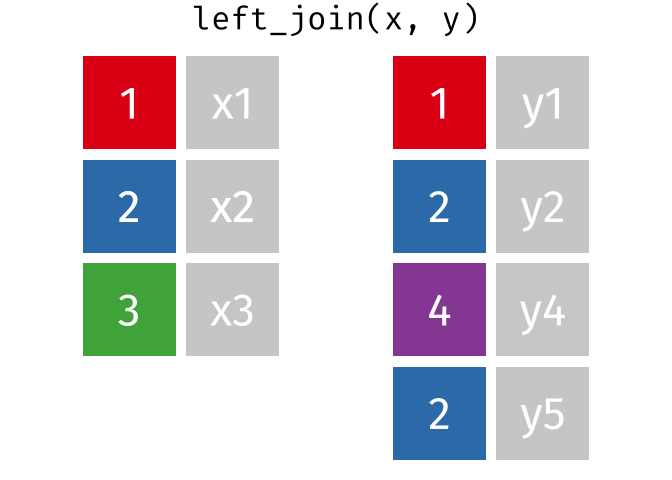
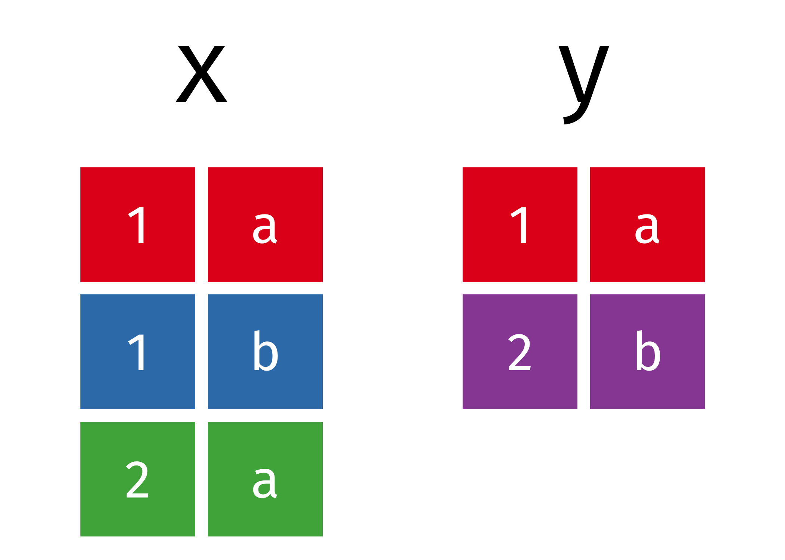
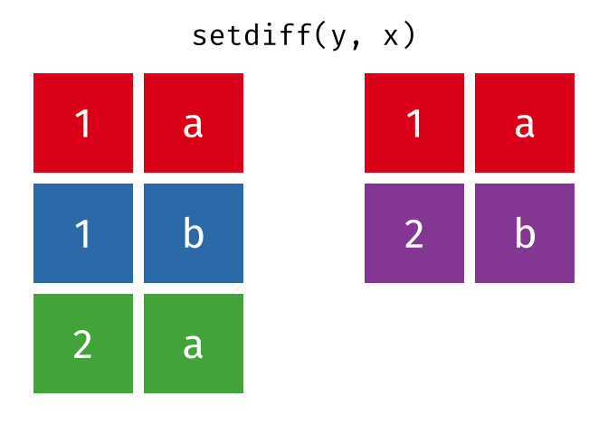
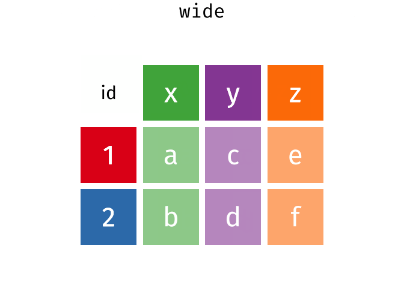

<!-- README.md is generated from README.Rmd. Please edit that file -->

# Tidy Animated Verbs

Garrick Aden-Buie – [@grrrck](https://twitter.com/grrrck) –
[garrickadenbuie.com](https://www.garrickadenbuie.com). Set operations
contributed by [Tyler Grant
Smith](https://github.com/TylerGrantSmith).

[](https://mybinder.org/v2/gh/gadenbuie/tidy-animated-verbs/master?urlpath=rstudio)
[_-CC0-green.svg)](https://creativecommons.org/publicdomain/zero/1.0/)
[_-MIT-green.svg)](https://opensource.org/licenses/MIT)

<!-- README START -->

  - [**Mutating Joins**](#mutating-joins) —
    [`inner_join()`](#inner-join), [`left_join()`](#left-join),
    [`right_join()`](#right-join), [`full_join()`](#full-join)

  - [**Filtering Joins**](#filtering-joins) —
    [`semi_join()`](#semi-join), [`anti_join()`](#anti-join)

  - [**Set Operations**](#set-operations) — [`union()`](#union),
    [`union_all()`](#union-all), [`intersect()`](#intersect),
    [`setdiff()`](#setdiff)

  - [**Tidy Data**](#tidy-data) — [`spread()` and
    `gather()`](#spread-and-gather)

  - Learn more about
    
      - [Using the animations and images](#usage)
      - [Relational Data](#relational-data)
      - [gganimate](#gganimate)

## Background

### Usage

Please feel free to use these images for teaching or learning about
action verbs from the [tidyverse](https://tidyverse.org). You can
directly download the [original animations](images/) or static images in
[svg](images/static/svg/) or [png](images/static/png/) formats, or you
can use the [scripts](R/) to recreate the images locally.

Currently, the animations cover the [dplyr two-table
verbs](https://dplyr.tidyverse.org/articles/two-table.html) and I’d like
to expand the animations to include more verbs from the tidyverse.
[Suggestions are
welcome\!](https://github.com/gadenbuie/tidy-animated-verbs/issues)

### Relational Data

The [Relational Data](http://r4ds.had.co.nz/relational-data.html)
chapter of the [R for Data Science](http://r4ds.had.co.nz/) book by
Garrett Grolemund and Hadley Wickham is an excellent resource for
learning more about relational data.

The [dplyr two-table verbs
vignette](https://dplyr.tidyverse.org/articles/two-table.html) and Jenny
Bryan’s [Cheatsheet for dplyr join
functions](http://stat545.com/bit001_dplyr-cheatsheet.html) are also
great resources.

### gganimate

The animations were made possible by the newly re-written
[gganimate](https://github.com/thomasp85/gganimate#README) package by
[Thomas Lin Pedersen](https://github.com/thomasp85) (original by [Dave
Robinson](https://github.com/dgrtwo)). The [package
readme](https://github.com/thomasp85/gganimate#README) provides an
excellent (and quick) introduction to gganimate.

### Dynamic Animations

Thanks to an initial push by [David Zimmermann](https://github.com/DavZim), we
have begun work toward a packaged set of functions to generate dynamic
explanatory animations from users' actual data.
Please visit the [pkg branch](https://github.com/gadenbuie/tidyexplain/tree/pkg) 
of the tidyexplain repository for more information (or to contribute!).

## Mutating Joins

> A mutating join allows you to combine variables from two tables. It
> first matches observations by their keys, then copies across variables
> from one table to the other.  
> [R for Data Science: Mutating
> joins](http://r4ds.had.co.nz/relational-data.html#mutating-joins)


``` r
x
#> # A tibble: 3 x 2
#>      id x    
#>   <int> <chr>
#> 1     1 x1   
#> 2     2 x2   
#> 3     3 x3
y
#> # A tibble: 3 x 2
#>      id y    
#>   <int> <chr>
#> 1     1 y1   
#> 2     2 y2   
#> 3     4 y4
```

### Inner Join

> All rows from `x` where there are matching values in `y`, and all
> columns from `x` and `y`.


``` r
inner_join(x, y, by = "id")
#> # A tibble: 2 x 3
#>      id x     y    
#>   <int> <chr> <chr>
#> 1     1 x1    y1   
#> 2     2 x2    y2
```

### Left Join

> All rows from `x`, and all columns from `x` and `y`. Rows in `x` with
> no match in `y` will have `NA` values in the new columns.


``` r
left_join(x, y, by = "id")
#> # A tibble: 3 x 3
#>      id x     y    
#>   <int> <chr> <chr>
#> 1     1 x1    y1   
#> 2     2 x2    y2   
#> 3     3 x3    <NA>
```

### Left Join (Extra Rows in y)

> … If there are multiple matches between `x` and `y`, all combinations
> of the matches are returned.



``` r
y_extra # has multiple rows with the key from `x`
#> # A tibble: 4 x 2
#>      id y    
#>   <dbl> <chr>
#> 1     1 y1   
#> 2     2 y2   
#> 3     4 y4   
#> 4     2 y5
left_join(x, y_extra, by = "id")
#> # A tibble: 4 x 3
#>      id x     y    
#>   <dbl> <chr> <chr>
#> 1     1 x1    y1   
#> 2     2 x2    y2   
#> 3     2 x2    y5   
#> 4     3 x3    <NA>
```

### Right Join

> All rows from y, and all columns from `x` and `y`. Rows in `y` with no
> match in `x` will have `NA` values in the new columns.


``` r
right_join(x, y, by = "id")
#> # A tibble: 3 x 3
#>      id x     y    
#>   <int> <chr> <chr>
#> 1     1 x1    y1   
#> 2     2 x2    y2   
#> 3     4 <NA>  y4
```

### Full Join

> All rows and all columns from both `x` and `y`. Where there are not
> matching values, returns `NA` for the one missing.


``` r
full_join(x, y, by = "id")
#> # A tibble: 4 x 3
#>      id x     y    
#>   <int> <chr> <chr>
#> 1     1 x1    y1   
#> 2     2 x2    y2   
#> 3     3 x3    <NA> 
#> 4     4 <NA>  y4
```

## Filtering Joins

> Filtering joins match observations in the same way as mutating joins,
> but affect the observations, not the variables. … Semi-joins are
> useful for matching filtered summary tables back to the original rows.
> … Anti-joins are useful for diagnosing join mismatches.  
> [R for Data Science: Filtering
> Joins](http://r4ds.had.co.nz/relational-data.html#filtering-joins)

### Semi Join

> All rows from `x` where there are matching values in `y`, keeping just
> columns from `x`.


``` r
semi_join(x, y, by = "id")
#> # A tibble: 2 x 2
#>      id x    
#>   <int> <chr>
#> 1     1 x1   
#> 2     2 x2
```

### Anti Join

> All rows from `x` where there are not matching values in `y`, keeping
> just columns from `x`.


``` r
anti_join(x, y, by = "id")
#> # A tibble: 1 x 2
#>      id x    
#>   <int> <chr>
#> 1     3 x3
```

## Set Operations

> Set operations are occasionally useful when you want to break a single
> complex filter into simpler pieces. All these operations work with a
> complete row, comparing the values of every variable. These expect the
> x and y inputs to have the same variables, and treat the observations
> like sets.  
> [R for Data Science: Set
> operations](http://r4ds.had.co.nz/relational-data.html#set-operations)



``` r
x
#> # A tibble: 3 x 2
#>   x     y    
#>   <chr> <chr>
#> 1 1     a    
#> 2 1     b    
#> 3 2     a
y 
#> # A tibble: 2 x 2
#>   x     y    
#>   <chr> <chr>
#> 1 1     a    
#> 2 2     b
```

### Union

> All unique rows from `x` and `y`.


``` r
union(x, y)
#> # A tibble: 4 x 2
#>   x     y    
#>   <chr> <chr>
#> 1 2     b    
#> 2 2     a    
#> 3 1     b    
#> 4 1     a
```


``` r
union(y, x)
#> # A tibble: 4 x 2
#>   x     y    
#>   <chr> <chr>
#> 1 2     a    
#> 2 1     b    
#> 3 2     b    
#> 4 1     a
```

### Union All

> All rows from `x` and `y`, keeping duplicates.


``` r
union_all(x, y)
#> # A tibble: 5 x 2
#>   x     y    
#>   <chr> <chr>
#> 1 1     a    
#> 2 1     b    
#> 3 2     a    
#> 4 1     a    
#> 5 2     b
```

### Intersection

> Common rows in both `x` and `y`, keeping just unique rows.


``` r
intersect(x, y)
#> # A tibble: 1 x 2
#>   x     y    
#>   <chr> <chr>
#> 1 1     a
```

### Set Difference

> All rows from `x` which are not also rows in `y`, keeping just unique
> rows.


``` r
setdiff(x, y)
#> # A tibble: 2 x 2
#>   x     y    
#>   <chr> <chr>
#> 1 1     b    
#> 2 2     a
```



``` r
setdiff(y, x)
#> # A tibble: 1 x 2
#>   x     y    
#>   <chr> <chr>
#> 1 2     b
```

## Tidy Data

[Tidy data](http://r4ds.had.co.nz/tidy-data.html#tidy-data-1) follows
the following three rules:

1.  Each variable has its own column.
2.  Each observation has its own row.
3.  Each value has its own cell.

Many of the tools in the [tidyverse](https://tidyverse.org) expect data
to be formatted as a tidy dataset and the
[tidyr](https://tidyr.tidyverse.org) package provides functions to help
you organize your data into tidy data.


``` r
wide
#> # A tibble: 2 x 4
#>      id x     y     z    
#>   <int> <chr> <chr> <chr>
#> 1     1 a     c     e    
#> 2     2 b     d     f
long
#> # A tibble: 6 x 3
#>      id key   val  
#>   <int> <chr> <chr>
#> 1     1 x     a    
#> 2     2 x     b    
#> 3     1 y     c    
#> 4     2 y     d    
#> 5     1 z     e    
#> 6     2 z     f
```

### Spread and Gather

`spread(data, key, value)`

> Spread a key-value pair across multiple columns. Use it when an a
> column contains observations from multiple variables.

`gather(data, key = "key", value = "value", ...)`

> Gather takes multiple columns and collapses into key-value pairs,
> duplicating all other columns as needed. You use `gather()` when you
> notice that your column names are not names of variables, but *values*
> of a variable.



``` r
gather(wide, key, val, x:z)
#> # A tibble: 6 x 3
#>      id key   val  
#>   <int> <chr> <chr>
#> 1     1 x     a    
#> 2     2 x     b    
#> 3     1 y     c    
#> 4     2 y     d    
#> 5     1 z     e    
#> 6     2 z     f
spread(long, key, val)
#> # A tibble: 2 x 4
#>      id x     y     z    
#>   <int> <chr> <chr> <chr>
#> 1     1 a     c     e    
#> 2     2 b     d     f
```
